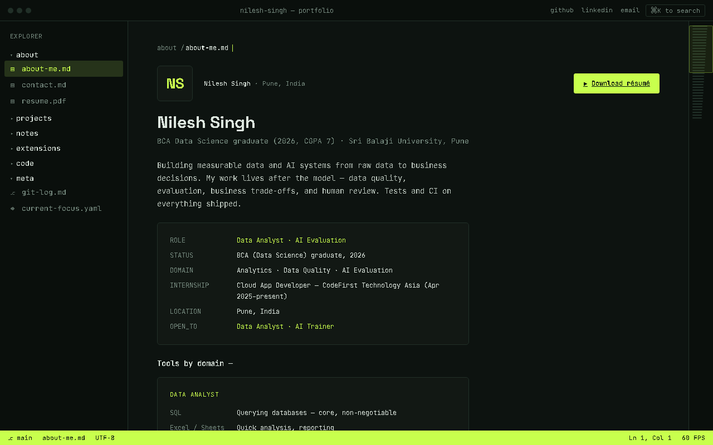

# Nilesh Singh — Portfolio

[](https://nilesh-portfolio-three.vercel.app/)
[](#tech-stack)
[](LICENSE)

A personal portfolio site styled as a VS Code editor window — file explorer sidebar, tabs, and a Markdown-preview-style renderer — built to present my work as Data Analyst / AI Evaluation projects rather than a typical "about me" page.

**Live site:** https://nilesh-portfolio-three.vercel.app/



---

## Overview

The site is laid out like a code editor, with the sidebar acting as navigation between sections:

- **about** — `about-me`, `how-i-work`
- **capabilities** — data cleaning & EDA, machine learning, data visualization, SQL & databases
- **projects** — TrainLens, LLM Safety & Response Evaluation Benchmark, Customer Churn Analysis, AI HR Automation Suite
- **blog** — short write-ups on building and evaluating the above projects
- **bookmarks** — tools, certifications, education
- **contact** — email, LinkedIn, GitHub

Each "file" in the sidebar renders as a page, in keeping with the editor metaphor (README, Markdown preview, tabs, status bar).

## Tech Stack

- **HTML5 / CSS3** — layout and the editor-chrome styling (sidebar, tabs, status bar)
- **Vanilla JavaScript** — navigation between sections, no framework or build step
- **Deployment** — [Vercel](https://vercel.com/)

No bundler, no package manager, no build pipeline — `index.html` is the entire site.

## Project Structure

```
nilesh-portfolio/
├── index.html      # entire site: markup, styles, and behavior
├── assets/         # images and static assets
├── .gitignore
└── README.md
```

## Getting Started

Clone the repo and open it directly — no install step required:

```bash
git clone https://github.com/Nilesh-builds/nilesh-portfolio.git
cd nilesh-portfolio
```

Then either:

- Open `index.html` directly in a browser, or
- Serve it locally so relative asset paths behave the same as in production:

```bash
npx serve .
# or
python -m http.server 8000
```

## Deployment

The site auto-deploys to Vercel on push to `main`. To deploy your own copy:

1. Fork this repo
2. Import it into [Vercel](https://vercel.com/new)
3. Framework preset: **Other** (static site) — no build command needed

## Roadmap

- [ ] Add remaining blog posts
- [ ] Expand the projects index with case-study pages
- [ ] Add light-theme toggle to complement the editor theme

## Contact

- **Email:** [kumarnilash509@gmail.com](mailto:kumarnilash509@gmail.com)
- **LinkedIn:** [nilesh-singh-b9b6932bb](https://www.linkedin.com/in/nilesh-singh-b9b6932bb/)
- **GitHub:** [@Nilesh-builds](https://github.com/Nilesh-builds)

## License

Code is available under the [MIT License](LICENSE). Please don't reuse the personal content (name, photos, résumé details, project write-ups) — feel free to fork the structure/theme for your own portfolio instead.
