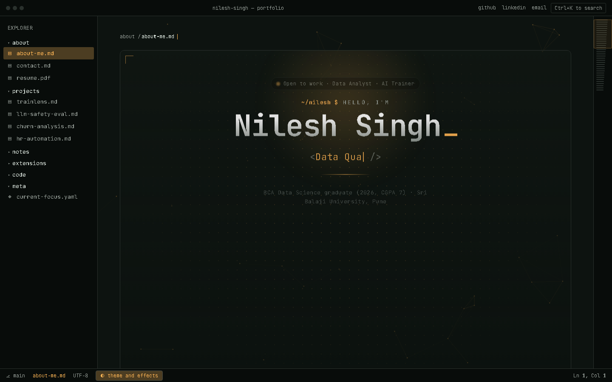
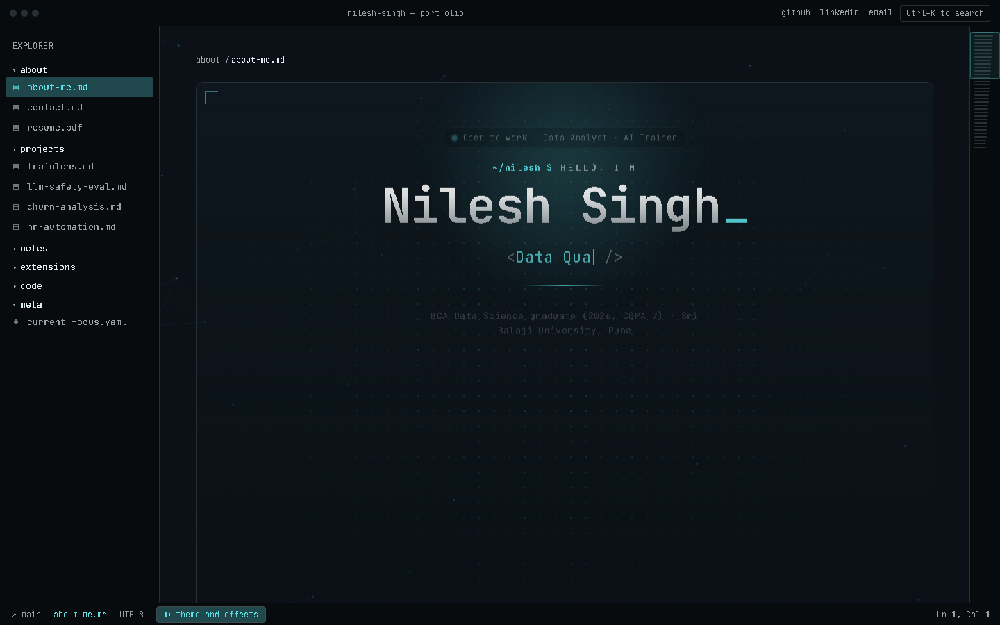
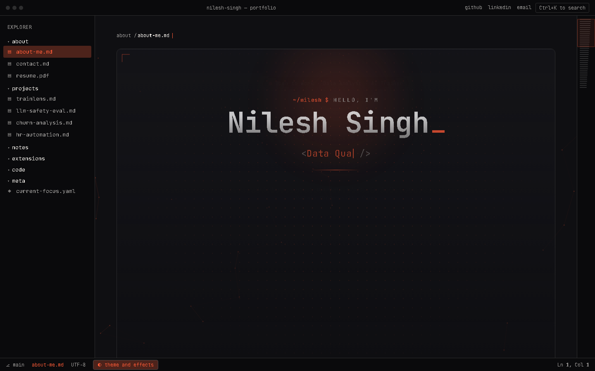
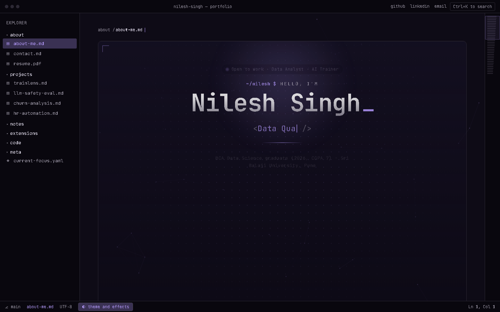
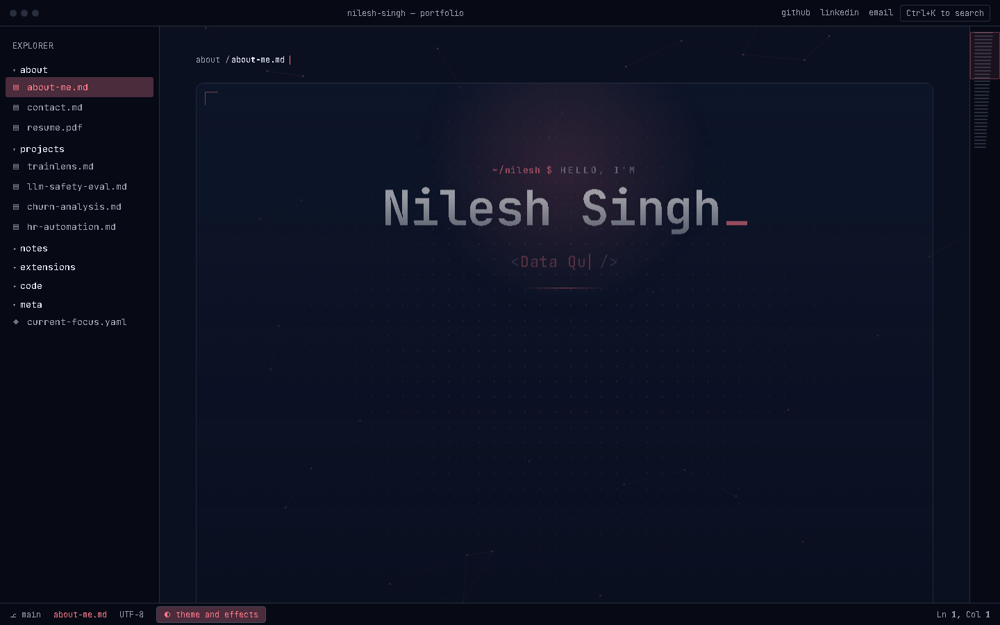
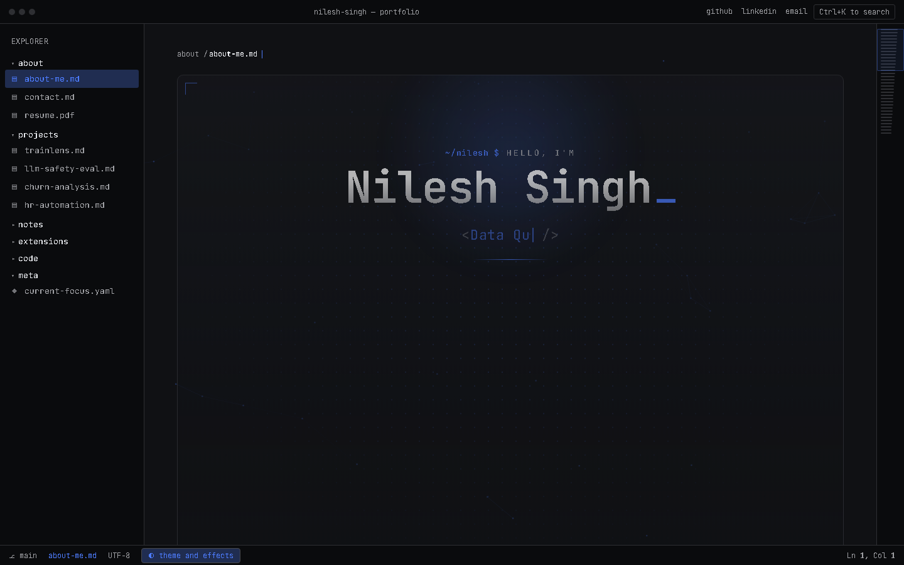
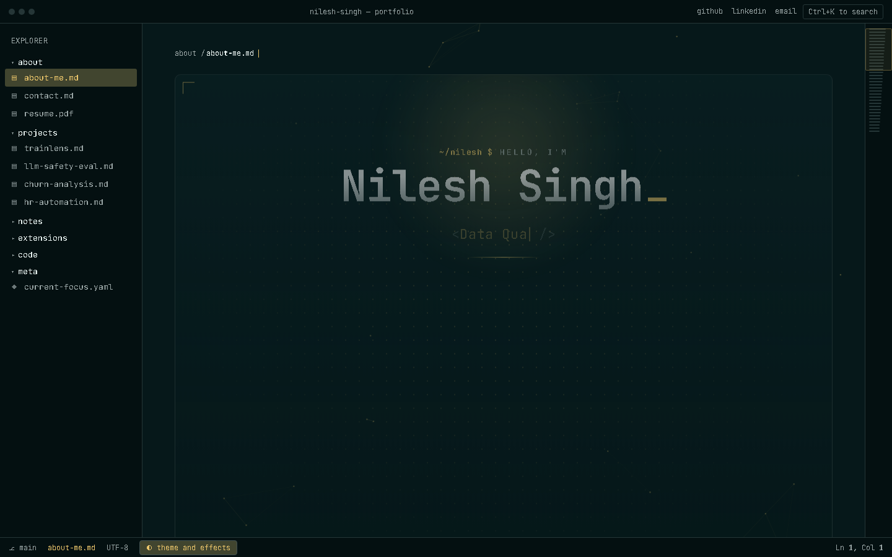
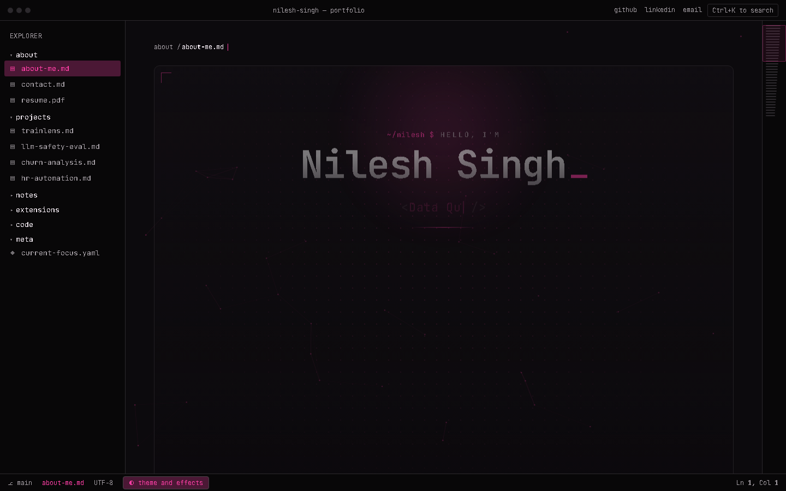
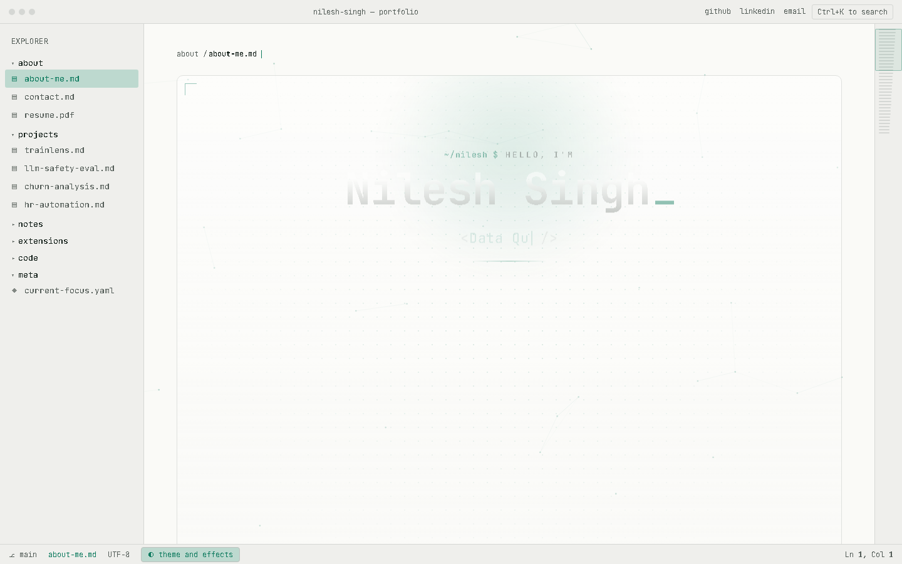
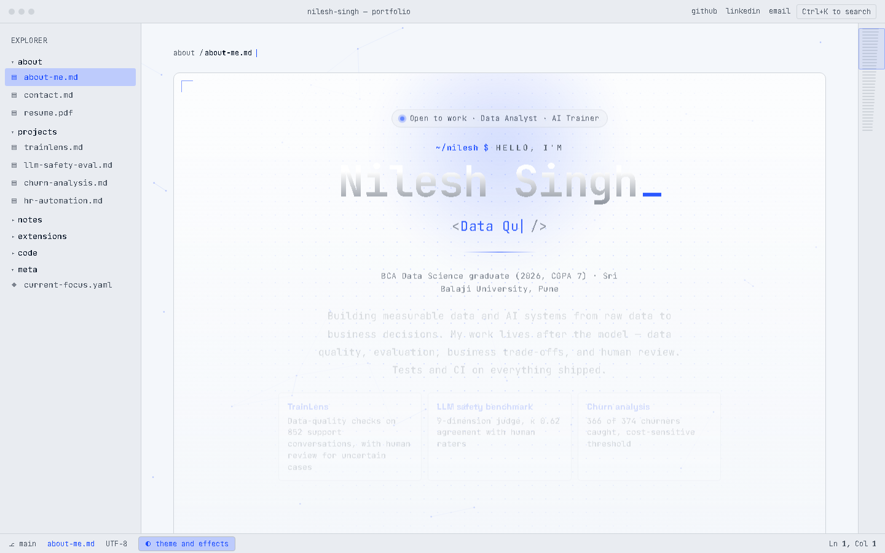

# Nilesh Singh — Portfolio

[](https://nilesh-portfolio-three.vercel.app/)
[](#tech-stack)
[](#-10-themes)
[](LICENSE)

A personal portfolio styled as a **VS Code editor window** — file explorer sidebar, command palette (`Ctrl+K`), animated hero, and Markdown-preview-style project pages — presenting work as **Data Analyst / AI Evaluation** case studies rather than a typical "about me" page.

**Live site:** https://nilesh-portfolio-three.vercel.app/


---

## ✨ Highlights

- **Editor metaphor, fully interactive** — boot-up typing sequence, explorer sidebar, tabs, status bar, `Ctrl+K` command palette, keyboard-navigable files
- **10 switchable colorways** — dark phosphor terminals, neon neons, plus two light paper themes; persisted via `localStorage`, one click in the *theme and effects* panel
- **Motion with manners** — typing hero, staggered pane entrances, magnetic buttons, spotlight cards, scroll-free layout, all disabled under `prefers-reduced-motion`
- **Evaluation-first projects** — TrainLens (98.85% data-quality score), 9-dimension LLM Safety Benchmark, cost-sensitive Churn Analysis, HR Automation Suite
- **One-click résumé** — the one-page PDF is embedded in the page and downloads instantly, always in sync with the site
- **Zero build step** — a single `index.html`, no bundler, no framework, auto-deployed on Vercel

## 🎨 10 themes

| # | Theme | Background | Accent |
|---|-------|------------|--------|
| 00 | Amber phosphor | `#0D1310` | `#FFB454` |
| 01 | Ice terminal | `#0B1116` | `#5CE1E6` |
| 02 | Ink and vermilion | `#0F0F12` | `#FF5A36` |
| 03 | Violet signal | `#0E0B16` | `#B69CFF` |
| 04 | Midnight and coral | `#0A1020` | `#FF7A8A` |
| 05 | Graphite and electric blue | `#101114` | `#4D7CFF` |
| 06 | Deep teal and gold *(default)* | `#06181A` | `#E9C46A` |
| 07 | Black and magenta | `#0C0A0D` | `#FF3EA5` |
| 08 | Paper and emerald | `#FAFAF7` | `#0F7B5F` |
| 09 | Blueprint | `#F4F7FB` | `#1F4FFF` |

| Amber phosphor | Ice terminal |
|---|---|
|  |  |

| Ink and vermilion | Violet signal |
|---|---|
|  |  |

| Midnight and coral | Graphite and electric blue |
|---|---|
|  |  |

| Deep teal and gold (default) | Black and magenta |
|---|---|
|  |  |

| Paper and emerald | Blueprint |
|---|---|
|  |  |

## 🗂️ What's inside

- **about** — `about-me`, `contact`, downloadable `resume.pdf`
- **projects** — TrainLens, LLM Safety & Response Evaluation Benchmark, Customer Churn Analysis, AI HR Automation Suite
- **notes** — short write-ups: cost-sensitive thresholds, trusting LLM judges, checking data before models
- **extensions / code / meta** — skills matrix, representative quality-check excerpt, current focus

## Tech Stack

- **HTML5 / CSS3** — editor chrome, hero, 10-theme CSS-variable engine
- **Vanilla JavaScript** — navigation, palette, boot sequence, theme/effects panel; no framework
- **Deployment** — [Vercel](https://vercel.com/)

```text
nilesh-portfolio/
├── index.html      # entire site: markup, styles, and behavior
├── assets/
│   ├── preview.png # hero screenshot (default theme)
│   └── themes/     # one screenshot per colorway (00–09)
├── .gitignore
└── README.md
```

## Getting Started

Clone and open — no install step:

```bash
git clone https://github.com/Nilesh-builds/nilesh-portfolio.git
cd nilesh-portfolio
```

Then either open `index.html` directly, or serve it so relative paths behave like production:

```bash
npx serve .
# or
python -m http.server 8000
```

## Deployment

Auto-deploys to Vercel on push to `main`. For your own copy:

1. Fork this repo
2. Import it into [Vercel](https://vercel.com/new)
3. Framework preset: **Other** (static site) — no build command needed

## Roadmap

- [ ] Add remaining blog posts
- [ ] Expand the projects index with full case-study pages
- [ ] PWA touches (installable, offline-first static shell)

## Contact

- **Email:** [kumarnilash509@gmail.com](mailto:kumarnilash509@gmail.com)
- **LinkedIn:** [nilesh-singh-data](https://www.linkedin.com/in/nilesh-singh-data/)
- **GitHub:** [@Nilesh-builds](https://github.com/Nilesh-builds)

## License

Code is available under the [MIT License](LICENSE). Please don't reuse the personal content (name, photos, résumé details, project write-ups) — feel free to fork the structure/theme for your own portfolio instead.
